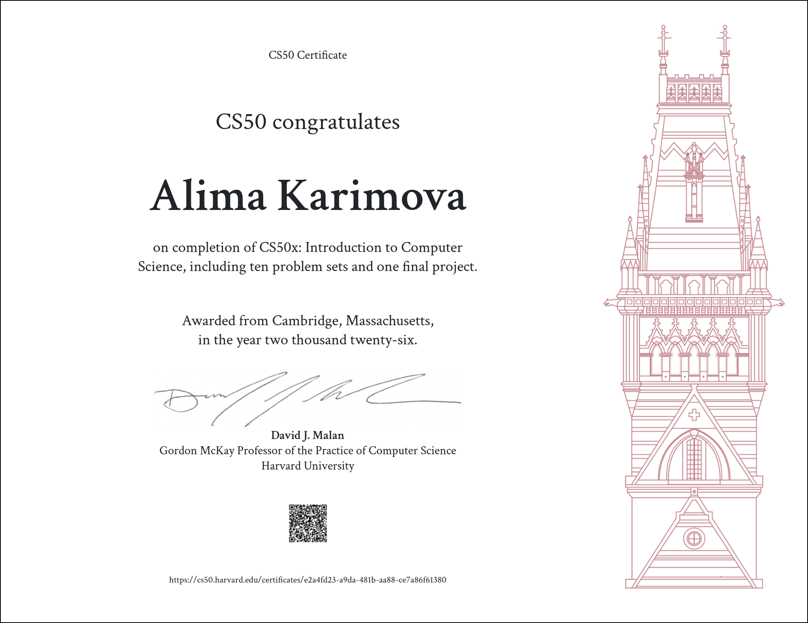

# CS50x 

This repository contains my solutions to all problem sets from **Harvard's CS50x**: Introduction to Computer Science.

**Notice:** *This repository stores my personal work for Harvard's CS50x. It is not an answer key or a shortcut. Current students are expected to follow the course's academic honesty policy and solve all problems independently.*

## About CS50x

CS50x is Harvard University's introductory computer science course covering:
- **C**: Pointers, memory management, algorithms, data structures
- **Python**: Scripting, data processing, file I/O
- **SQL**: Database querying, schema design
- **Flask**: Web development with Python
- **HTML, CSS, JavaScript**: Front-end development

